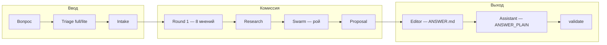

# Congress

**Congress** — мультиагентная «комиссия» для [Cursor](https://cursor.com): воспроизводимое экспертное заключение на диске, а не один ответ чата.

Вы задаёте вопрос (стратегия, архитектура, продукт, право, безопасность). **Ведущий (chair)** в Agent-чате проводит сессию по протоколу: уточняет контекст, запускает параллельных **комиссаров** (subagent), роевой диалог, **редактора** и **ассистента**. На выходе — развёрнутый русский отчёт **`ANSWER.md`**, проверенный скриптом **`validate`**.

Репозиторий: [github.com/ahagaraya/cursor-congress](https://github.com/ahagaraya/cursor-congress)

---

## Зачем это нужно

| Обычный чат | Congress |
| --- | --- |
| Одна модель, один угол | 8 перспектив с фиксированными ролями |
| Ответ теряется в истории | Сессия — папка: мнения, рой, исследования, конфликты |
| Краткий ответ «как получится» | **ANSWER.md** — статья с таблицами, рисками, планом |
| Нет проверки полноты | **`validate --gate full`** — жёсткие ворота перед «готово» |

Congress не заменяет юриста, аудитора или продакшн-деплой. Это **структурированная аналитика** с disclaimer в каждом отчёте.

---

## Как устроено

Три слоя:

1. **Cursor skill** (`.cursor/skills/congress/`) — протокол, персоны комиссаров, стиль ответа. Agent читает skill и знает, что делать.
2. **Chair (вы + Agent)** — оркестрация: `AskUserQuestion`, `Task` для комиссаров, решения по фазам.
3. **CLI на Node.js** (`scripts/`, `swarm/`) — порядок фаз, router роя, JSON-схемы, lint, CI. Модели пишут файлы; скрипты **проверяют**, что ничего не пропущено.



---

## Роли

### Ядро (голосуют в Round 1 и рое)

| Роль | Фокус |
| --- | --- |
| **critic** | Слабые места, риск самообмана, «зачем вообще» |
| **architect** | Границы системы, эволюция, переносимость |
| **pragmatist** | Сроки, стоимость внимания, что реально сделает соло |
| **tech-lead** | Стек, эксплуатация, бэкапы, пороги масштаба |
| **developer** | Реализация, миграции, person-days |
| **lawyer** | Право, договоры, ПДн (152-ФЗ), compliance |
| **security** | Операционные риски, SLA, восстановление |
| **cybersec** | Поверхность атаки, шифрование, доступы |

### Поддержка

| Роль | Когда |
| --- | --- |
| **researcher** | Веб-поиск по запросам из мнений/роя (blocking — до роя) |
| **editor** | Пишет **ANSWER.md** после proposal (статья + таблицы) |
| **assistant** | **ANSWER_PLAIN.md** + **glossary/** — последний шаг |

### Опционально (по теме вопроса)

**economist**, **marketer**, **product-manager** — подключаются через `optional-roles` или авто-детект из BRIEF.

---

## Режимы: full и lite

Перед анализом **обязательно** спросить пользователя (`triage`):

| | **full** | **lite** |
| --- | --- | --- |
| Комиссары | 8 | 4 (critic, architect, pragmatist, tech-lead) |
| Рой | ≥ 3 хода | ≥ 1 ход |
| Отчёт | ~1500–8000 слов | короче |
| Время | ~10 мин | ~5 мин |
| Когда | сделки, стратегия, высокие риски | уточнения, узкие вопросы |

Запись режима: `commission_mode: full|lite` в `assumptions.yaml`.

---

## Фазы сессии (строгий порядок)

| # | Фаза | Что происходит |
| --- | --- | --- |
| 0 | **triage** | full или lite |
| 1 | **intake** | Уточняющие вопросы → `intake/answers.yaml` |
| 2 | **brief** | `BRIEF.md`, `assumptions.yaml` |
| 3 | **r1** | 8 (или 4) параллельных `opinions/*.json` |
| 3a | **optional_r1** | Опциональные комиссары при необходимости |
| 4 | **research** | Blocking-запросы → `research/findings/` |
| 5 | **merge** | `conflicts.json`, `consensus.json` |
| 6 | **swarm** | Роевой диалог через `swarm/router.mjs` |
| 7 | **proposal** | `deliberation/proposal.json` (вердикт chair) |
| 8 | **editor** | **ANSWER.md** |
| 9 | **assistant** | ANSWER_PLAIN + glossary |
| 10 | **validate** | `validate --gate full` — exit 0 |

Продолжить прерванную сессию: `node scripts/run.mjs sessions/<slug> status` → `next`.

---

## Папка сессии

Каждая сессия живёт в `sessions/<slug>/` (в **gitignore** — не коммитьте с ПДн):

```text
sessions/2026-my-topic/
├── BRIEF.md                 # вопрос и контекст
├── assumptions.yaml         # факты, commission_mode, ограничения
├── intake/
│   ├── questions.yaml
│   └── answers.yaml
├── opinions/                # Round 1 — по файлу на роль
│   ├── critic.json
│   └── …
├── research/
│   ├── requests/
│   └── findings/
├── deliberation/
│   ├── state.json           # фаза, checkpoint
│   ├── proposal.json
│   ├── conflicts.json
│   ├── consensus.json
│   ├── events.jsonl         # лог для UI
│   └── swarm/
│       ├── router-state.json
│       ├── messages.jsonl
│       └── turns/           # ходы роя
├── ANSWER.md                # итог редактора
├── ANSWER_PLAIN.md
└── glossary/glossary.md
```

Публичный пример без секретов: [`examples/demo-session/`](examples/demo-session/) (SQLite vs PostgreSQL для MVP).

---

## Быстрый старт

### Требования

- [Cursor](https://cursor.com) с **Agent** (нужен **Task** / subagents)
- **Node.js** 18+

### Установка

```bash
git clone https://github.com/ahagaraya/cursor-congress.git
cd cursor-congress
npm install
```

### Посмотреть demo

```bash
npm run validate:demo
```

Откройте [`examples/demo-session/ANSWER.md`](examples/demo-session/ANSWER.md) — полная сессия, ~3700 слов, прошла `validate --gate full`.

### Запуск в Cursor (рекомендуется)

1. Откройте клон репозитория как **workspace** в Cursor.
2. Skill подхватится из `.cursor/skills/congress/`.
3. В Agent-чате:

> Установи congress (`npm install`). Запусти конгресс на: «стоит ли …»

Agent спросит **full/lite** и **intake**, затем проведёт комиссию. В конце — `validate`.

### Запуск вручную (CLI + chair)

```bash
node scripts/new-session.mjs 2026-my-topic --question "Ваш вопрос"
node scripts/run.mjs sessions/2026-my-topic triage
# → AskUserQuestion → node scripts/triage.mjs sessions/2026-my-topic --set full

# Chair: Task для каждой роли Round 1, swarm, editor, assistant
node scripts/run.mjs sessions/2026-my-topic advance --phase r1
# … см. scripts/run.mjs sessions/... next

node scripts/run.mjs sessions/2026-my-topic validate --skip-intake
```

---

## Оркестратор `run.mjs`

Единая точка входа для chair:

```bash
node scripts/run.mjs sessions/<slug> status      # где остановились
node scripts/run.mjs sessions/<slug> next        # что читать/писать на этой фазе
node scripts/run.mjs sessions/<slug> advance     # закрыть фазу
node scripts/run.mjs sessions/<slug> triage
node scripts/run.mjs sessions/<slug> optional-roles
node scripts/run.mjs sessions/<slug> swarm-init
node scripts/run.mjs sessions/<slug> swarm-step
node scripts/run.mjs sessions/<slug> swarm-process <role> <turn-file>
node scripts/run.mjs sessions/<slug> validate
```

Флаги: `--skip-intake`, `--no-assistant`, `--warn`, `--json`, `--phase <name>`.

---

## Роевой диалог (swarm)

Комиссары обмениваются сообщениями с маршрутизацией (кто кого привлекает). Router:

```bash
node swarm/router.mjs init sessions/<slug>
node swarm/router.mjs active sessions/<slug>      # кто пишет на этом такте
node swarm/router.mjs process sessions/<slug> critic sessions/<slug>/deliberation/swarm/turns/critic-t0.json
node swarm/router.mjs advance-tick sessions/<slug>
node swarm/router.mjs should-stop sessions/<slug>   # stop: true → завершить рой
```

Схема хода: `deliberation/swarm/turns/{role}-t{tick}.json` — `content`, `route.next[]`, опционально `research_requests[]`, `propose_stop`.

Подробнее: [`swarm/README.md`](swarm/README.md).

---

## Validate — ворота качества

```bash
node scripts/validate-session.mjs sessions/<slug> --gate full
```

Проверяет: triage, intake, 8 мнений, схемы JSON, завершённый рой (≥3 хода в full), proposal, **ANSWER.md** (объём, prose, без жаргона), ANSWER_PLAIN, glossary.

| Gate | Назначение |
| --- | --- |
| `intake` | ответы или документированный skip |
| `r1` | мнения комиссаров |
| `swarm` | router completed, ходы |
| `answer` | ANSWER + lint |
| `full` | всё включая assistant |

В CI: `npm test` + `npm run validate:demo`.

---

## Редактор и стиль ответа

**Editor** не голосует — оформляет `proposal.json` в читаемый отчёт:

- связная русская проза;
- **«Вариант N: …»** в анализе вариантов;
- сводные **таблицы** (сравнение, риски, триггеры);
- списки и **жирный/курсив** где уместно;
- disclaimer и статус полноты.

Lint: `npm run lint:prose`, `npm run lint:answer` (встроены в validate).

Полные правила: `.cursor/skills/congress/references/answer-style.md`.

---

## Live UI и индикатор

**Браузер** — живой лог сессии:

```bash
npm run ui
# http://127.0.0.1:3747
```

При активной сессии — баннер «Congress работает», список сессий, события роя.

**Status line в Cursor** (опционально):

```bash
npm run install-cursor-indicator
```

См. [`docs/cursor-indicator.md`](docs/cursor-indicator.md).

---

## Безопасность

- **`sessions/` не коммитьте** — там могут быть ПДн, договоры, черновики.
- Не храните `sessions/` в iCloud/Dropbox без шифрования — см. [`docs/security-sessions.md`](docs/security-sessions.md).
- Pre-commit (опционально): `npm run install-hooks`

---

## npm-скрипты

| Команда | Действие |
| --- | --- |
| `npm test` | Unit-тесты router + run + lint + triage |
| `npm run validate:demo` | Проверка `examples/demo-session` |
| `npm run new-session` | Шаблон новой сессии |
| `npm run ui` | Live UI |
| `npm run export-demo` | Экспорт сессии в `examples/` |
| `npm run install-cursor-indicator` | Индикатор в Cursor |
| `npm run clean-sessions` | Очистка старых `sessions/` |

---

## Структура репозитория

| Путь | Назначение |
| --- | --- |
| `.cursor/skills/congress/` | Skill, персоны, протоколы, JSON-схемы |
| `scripts/` | run, validate, triage, lint, new-session |
| `swarm/` | router роя |
| `templates/session/` | Шаблон пустой сессии |
| `examples/demo-session/` | Публичный demo (в git) |
| `ui/` | Live UI |
| `docs/` | Индикатор, безопасность |

Полный протокол для chair: [`.cursor/skills/congress/SKILL.md`](.cursor/skills/congress/SKILL.md).

---

## Для кого

- Power-users **Cursor** с редкими, но важными решениями (архитектура, сделки, запуск продукта).
- Соло-фаундеры и консультанты, которым нужен **воспроизводимый отчёт**, а не переписка.
- Команды, готовые потратить **1–3 часа и токены** на полную комиссию или **30–60 мин** на lite.

Не для: мгновенных ответов в одно предложение, задач без неопределённости, production без человеческой проверки фактов.

---

## Участие и лицензия

- Как добавить demo: [`CONTRIBUTING.md`](CONTRIBUTING.md)
- Примеры: [`examples/README.md`](examples/README.md)

**Лицензия:** [MIT](LICENSE) — код и skill.

**Отчёты `ANSWER.md`** — аналитический материал ИИ, **не** юридическая, финансовая или иная профессиональная консультация. Решения и проверка фактов — на вас.
